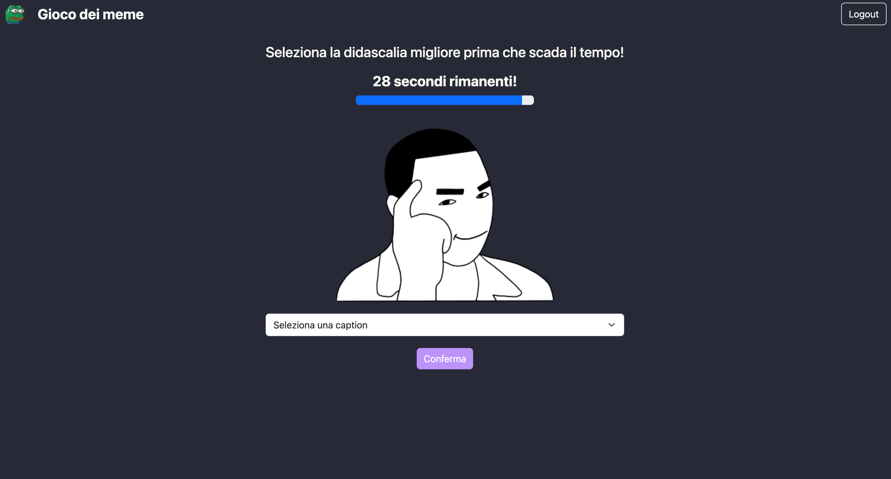
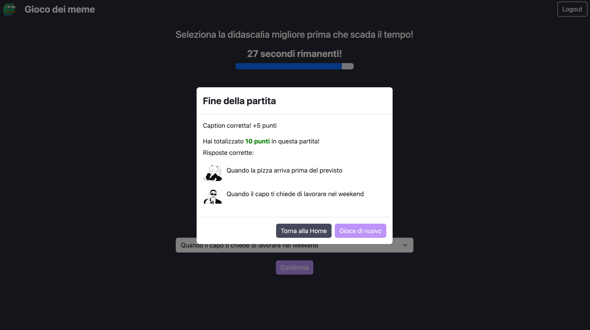

# Exam #1: "Gioco dei Meme"
## Student: s324218 CARLINO MATTIA 

## React Client Application Routes
- **Route `/`**: Home Page
  - **Page Content and Purpose**: Displays the main landing page of the application. It contains the card to play a game and to navigate to the login form.
  - **Props**: `loggedIn` is passed to determine if the user is logged in.

- **Route `*`**: Not Found Page
  - **Page Content and Purpose**: Displays when the URL doesn't match any existing routes.
  - **Element**: `<NotFoundComponent />` is rendered.

- **Route `/login`**: Login Page
  - **Page Content and Purpose**: Displays the login form.
  - **Props**: `login` function (`handleLogin`) is passed to handle user login.

- **Route `/game`**: Game Page
  - **Page Content and Purpose**: Displays the game interface.
  - **Props**: `loggedIn` and `user` are passed to the `<Game />` component.

- **Route `/profile`**: Profile Page
  - **Page Content and Purpose**: Displays the game history of the logged-in user.
  - **Props**: `user` is passed to the `<GameHistory />` component.

## API Server
### Meme 

- GET `/api/memes`
  - **Request Parameters:** None
  - **Response Body Content:**
    - If successful, returns a JSON object containing a random meme.
    - If there is a server error, returns a 500 status code with no additional content.

- PUT `/api/memes`
  - **Request Parameters and Request Body Content**: None
  - **Response Body Content**: None
    - This endpoint restores the previously used memes in the server's database. If successful, it responds with a status code indicating success (200 OK). If there's an error during the restoration process, it responds with a status code of 500 indicating a server error.

### Caption
- GET `/api/captions/meme/:id`
  - **Request Parameters:**
    - `id` (URL parameter): The ID of the meme for which to retrieve the five random captions and the two correct captions.
  - **Response Body Content:**
    - If successful, returns a JSON array of captions for the specified meme.
    - If the meme with the specified ID does not exist, returns a 404 status code with an error message.
    - If there is a server error, returns a 500 status code with no additional content.

### Games History
- POST `/api/games` 
  - **Request Parameters and Request Body Content**: Requires the request body containing `user` and `game` data.
  - **Response Body Content**: Returns the result of inserting the game result into the database.

- GET `/api/games/history/:userId`
  - **Request Parameters**: `userId` parameter in the URL path.
  - **Response Body Content**: Returns the history of games for the specified `userId`.

### Session
- POST `/api/sessions`
  - **Request Parameters and Request Body Content**: Expects credentials in the request body for user authentication.
  - **Response Body Content**: On successful authentication, returns the authenticated user information; on failure, returns authentication error messages.

- GET `/api/sessions/current`
  - **Request Parameters**: None.
  - **Response Body Content**: Returns the current authenticated user's information if authenticated; otherwise, returns a 401 error indicating not authenticated.

- DELETE `/api/sessions/current`
  - **Request Parameters**: None.
  - **Response Body Content**: Logs out the current authenticated session. 

## Database Tables

### Table `users`
- **Description**: Contains information about registered users.
- **Columns**:
  - `id`: INTEGER, autoincrement
  - `name`: TEXT, user's name
  - `email`: TEXT, user's email
  - `password`: TEXT, hashed password
  - `salt`: TEXT, password salt

### Table `caption`
- **Description**: Stores captions for memes.
- **Columns**:
  - `id`: INTEGER, autoincrement
  - `meme_url`: TEXT, meme's image URL

### Table `meme`
- **Description**: Stores memes and associated captions.
- **Columns**:
  - `id`: INTEGER, autoincrement
  - `text`: TEXT, caption text
  - `used`: INTEGER, indicates if the meme has been used in a game

### Table `game_history`
- **Description**: Records game history for users.
- **Columns**:
  - `user_id`: INTEGER, referencing `users(id)`
  - `game_id`: INTEGER, game's identifier
  - `round`: INTEGER, game round number
  - `caption`: TEXT, selected caption in the round
  - `caption_id`: INTEGER, referencing `caption(id)`
  - `meme_id`: INTEGER, referencing `meme(id)`
  - `image`: TEXT, URL of the meme image used in the round
  - `correct`: INTEGER, indicates if the user selected the correct caption
  - `score`: INTEGER, round score
  - `date`: TEXT, date of the game session

### Table `meme_caption`
- **Description**: Manages associations between memes and captions.
- **Columns**:
  - `id`: INTEGER, id of the associations
  - `meme_id`: INTEGER, referencing `meme(id)`
  - `caption_id`: INTEGER, referencing `caption(id)`

## Main React Components

- `LoginForm` (in `Auth.jsx`): Manages user authentication with a login form.
- `Game` (in `Game.jsx`): Core component handling game logic and user interactions during gameplay.
- `Home` (in `Home.jsx`): Landing page featuring a game card for gameplay initiation and user authentication.
- `GameHistory` (in `GameHistory.jsx`): Displays user-specific game history and related information.
- `CountdownTimer` (in `CountdownTimer.jsx`): Component responsible for setting and displaying the countdown timer for game rounds.
- `CardUserChoice` (in `Card.jsx`): Component housing cards used for login and game interactions.
- `Header` (in `Header.js`): Header of the application.
- `NotFound` (in `NotFoundComponent.jsx`): Component displayed when users navigate to an unknown route.  
- `ModalSubmitResponse` (in `ModalSubmitResponse.jsx`): Modal component presenting a summary of round or game.

## Screenshot

## Users Credentials

- username: mattia.carlino@polito.it, password: appweb2024
- username: user2@gmail.com, password: webapp2024
